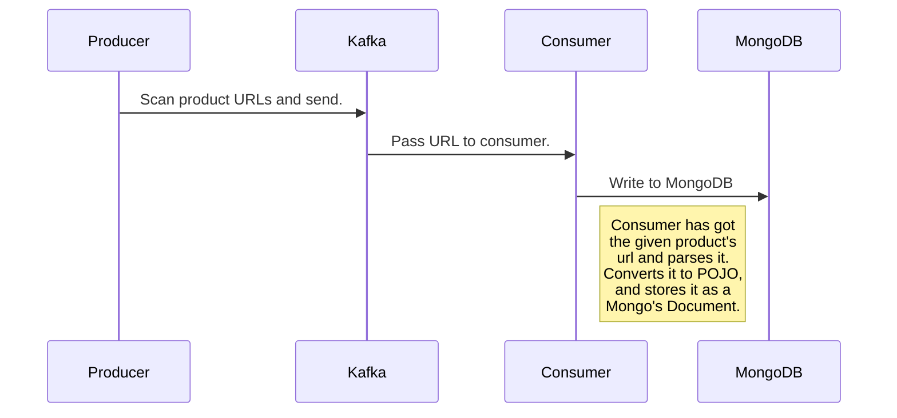

**Please view this document at https://stackedit.io. Just copy contents and paste it in left pane.**

---

# Jewel Store - Big Data Internship
This project aims to understand basic capabilities of interviewer about Big Data.
In the end of this project, we are expecting following results:
- The code block which starts `// TODO` must be filled.
- The code block which starts `// TODO` must be explained.
- `QUESTIONS.md` file must be filled.
- The project's code base must be pushed to repository as Git's `pull request`

# Story Of Project
Altınbaş is one of the biggest companies in Turkey's jewel market. Like every company, they have lots of product types which based on luxury, shape and concern and server on a website so users can visit and buy.
For this project we focus on a category called "Diamond Solitaire Ring (Pırlanta Tektaş Yüzük)" at this URL: https://www.altinbas.com/pirlanta-tektas-yuzukler
This website has very common e-commerce design. Every single product has it's own price, name, image and URL. We can visit all available pages and see full list of products by clicking page numbers.
But this page does not covers the products detail. It shows basic information about products but not much. We have to click for each product and navigate it's own page to see all details.
For instance, take a look at the detail of a product at this URL: https://www.altinbas.com/urun/pirlanta-tektas-yuzuk-pins102-8k
At the top of the page we can see price of product. If scroll down a bit, we can notice that product has some features that increase or decrease price.

**So goal of this project is collect the product's information from every page which has maximum 30 products, transform, store and read for machine learning model afterward.**

# Technologies / Technical Details

  - Java
  - Apache Spark
  - Apache Kafka
  - MongoDB
  - Basic HTML
  - Basic CSS

# Beginning
For start to begin, we must clone repository first. After clone we can imagine whole process cycle like diagram below:

## Components Of Data Collecting Operation
In the diagram above, we named component names simply. But we must know each one's goal, used technologies and principles.

### 1) Producer
Producer is beginning of this project. The reason is that; if we don't trick the whole process, it will not start and rest of it will be useless. So producer is our ticket to begin.
Then how we get start? Or where we get start? Let's navigate to module  `jewel-data-collect`. Under `com.exastax.internship.jewel.datacollect.starter` package there is only one class  called `DataProducerMain`. This class tricks the whole process by calling HTTP request to URL.
As we mentioned at the beginning of the project, we are only interested in  one category, so the URL must be that category's URL. But in code, it's different. Because if we navigate to another page in the browser, the category's URL will be changed. it is longer now. But if we keep navigating the pages, we can notice only one thing is changing. It is a parameter called `sayfax`.
So this parameter stands for the current page. Every single page loads different products. But it shows maximum 30 products.
So how can we know number of the pages? Let's read lines 38 and 40 in the class.

    Line 38: final Elements pagerItems = page.getElementsByClass("pagement_list").get(0).getElementsByTag("li");

    Line 40: final int totalPageCount = pagerItems.size() - 2; // result is 6

At the bottom of the page, the navigator of pages has CSS class called `pagement_list`. This this navigator is simple HTML tag `ul` and has child items `li`. So if we can get number of `li` tags we get number of pages.
That is what line 38 does.
But navigator has extra arrows at the beginning and end. So we must get rid of them so we need to subtract 2 from number of the `li` tags count.
That is what line 40 does.
So we can iterate the pages. By changing the current page's number, we can get all products.
After we understand page iteration, we need to find every single product's URL. To do this, we need to find something in HTML code which belongs to product.
Every product in page, wrapped by CSS class called `product-box`. This class contains an anchor which points to product's URL. By selecting `href` attribute of anchor, we get the product's URL also the element which has `product-box` class, contains an attribute called `uid`. This attribute is used for representing basic identity number for product.
So far, we know product's ID and URL. We are ready to send those informations to Kafka. The key must be ID and value must be URL.
> Notice that at the line 60, we added static text to beginning of the URL.

#### Some helpful links for Kafka:
- [Installing and running.](https://www.tutorialspoint.com/apache_kafka/apache_kafka_installation_steps.htm)
- [Creating a topic](https://kafka.apache.org/quickstart#quickstart_createtopic)
- [Testing](https://kafka.apache.org/quickstart#quickstart_consume)

### 2) Consumer
Consumer is basic streaming application which runs with Apache Spark. We know that Apache Spark has great API's for streaming and it has connector for Apache Kafka. So we can process Kafka's data with Spark.
Our consumer module is called `jewel-data-collect`
So this operation has to be done when we transform product's information to `JewelItem` POJO which is located under module `jewel-core` and package` com.exastax.internship.jewel.core`. Following attributes in page should be assigned to POJO's attributes.
|#|Product Attribute |POJO Attribute|
|--|--|--|
|| `ID`| `id`|
|| `Fiyat` |`price`|
|1|`Ağırlık`|`weight`|
|2|`Ayar`|`carat`|
|3| `Taş` |`diamondType`|
|4|`Ağırlık`|`diamondWeight`|
|5|`Renk`|`diamondColor`|
|6|`Berraklık`|`diamondClarity`|
|7|`Şekil`|`diamondShape`|

> This process must be done in class `com.exastax.internship.jewel.datacollect.streaming.URLResultMapFunction`

After we transformed our data to POJO, we need an another transformation for store it in MongoDB. So we need to convert our POJO to another class called `Document` which is MongoDB's data format.
> This process must be done in class `com.exastax.internship.jewel.datacollect.streaming.JewelItemToDocumentFunction`

Next step is writing the `Document` into database.
> This process must be done in class `com.exastax.internship.jewel.datacollect.streaming.MongoSink`

If everything was fine, we should have ended up with collection that has 180 records.
> It is possible to get products more then 180 or less. That website is updating everyday. But more then 190 or less then 170 is abnormal.  You can check total products count at the top of the category page.
If you encounter this situation anyway, please let us know.

## Predicting Product's Price By Using Machine Learning
After streaming process, we stored all products in database. With given attributes, we can predict price of product.
There are two classes for building model and test under module `jewel-ml` and package `com.exastax.internship.jewel.ml.predict`
- `TrainerMain` class stands for build regression model and write it.
- `TestMain` class stands for read model files and predict price.

Both classes are ready to run and debug easily by using IDE.

> By using Apache Spark's SQL, we can load data from external data sources and use.
> - `TrainerMain` class loads data from MongoDB by using exposed class `MongoSpark`.
> - `TestMain` class loads data from CSV file `test.csv` located at `resources` folder.

After successfully build training model, two folders should be appeared under root module.

- `pipeline_model` stands for transformations of data.
- `regression_model` stands for apply data to regression function.

---
**We hope it is useful for future works. Don't forget to push your code to remote repository.
Good luck.**